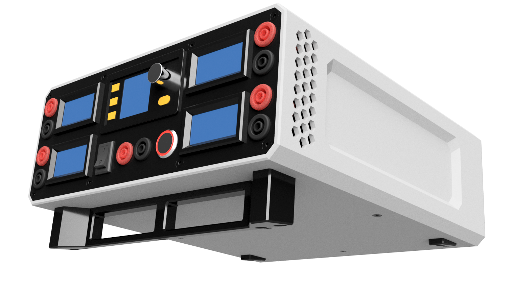

# DIY Laboratory Power Supply

A modular 3D-printed laboratory power supply designed for educational environments, workshops, and electronics labs. The enclosure and front panel layout were developed based on practical experience working with students and teachers to provide a clean, intuitive, and safe user experience.

---

---

# Features

- Fixed voltage outputs:
  - 3.3V
  - 5V
  - 12V
  - 24V
- Adjustable output using DPS3005 DC converter:
  - 0–24V
  - 0–5.1A
- Individual voltage and current monitoring for each fixed output
- Relay-controlled master output enable/disable switch
- Quiet active cooling with 60×60mm 5V fan
- Modular 3D-printable enclosure design
- Bi-color enclosure styling for improved visibility and usability
- Front panel elevated by 7° for easier viewing and operation

---

# Front Panel Overview

The front panel contains:

- Banana plug terminals for:
  - 3.3V
  - 5V
  - 12V
  - 24V
- DPS3005 programmable DC converter module
- Main power switch for turning the entire device ON/OFF
- LED push-button connected to a relay for enabling/disabling outputs

When the relay-controlled output switch is OFF:

- All outputs are disconnected
- Voltmeters and ammeters display 0V and 0A
- The LED indicator is OFF

The DPS3005 module also includes its own independent ON/OFF control button.

The layout and component placement were selected through practical usage and testing in educational environments to improve usability and focus for students.

---

# Enclosure Design

The enclosure was modeled in Autodesk Fusion 3D CAD software with a modular design philosophy.

The idea behind the enclosure is to allow users to customize:

- Front panels
- Back panels
- Mesh base sections

This makes it easy to adapt the enclosure for different power supply configurations or future upgrades.

## Enclosure Parts

The enclosure consists of 7 separate parts:

1. Enclosure body (490g)
2. Front panel (26g)
3. Mesh base (40g)
4. Two small back feet (2x1g)
5. Front elevation feet (28g)
6. Back panel (45g)

---

# Assembly

Assembly is designed to be simple and modular.

## Basic Assembly Process

1. Prepare the mesh base and panels
2. Install and wire components according to your requirements
3. Slide the mesh and back panel into the enclosure from the front side
4. Screw in:
   - Mesh base
   - Small back feet
   - Front elevation feet
5. Attach the front and back panels

---

# Cooling System

Cooling is provided by a 60×60mm fan powered from 5V.

The enclosure includes hexagonal side cutouts which:

- Improve airflow
- Reduce internal temperatures
- Keep fan noise low

---

# Electronics

The power supply is based on:

- 24V 8A AC/DC converter
- DPS3005 programmable DC converter
- 3× XL4016 DC/DC converters for:
  - 3.3V
  - 5V
  - 12V outputs

Each voltage rail includes:

- Voltmeter
- Ammeter

When outputs are disabled, all meters display 0V and 0A.

---

# Ergonomics

The enclosure front is elevated by approximately 7° to improve:

- Visibility
- Accessibility
- User comfort during operation

Optional rubber feet can be added if a flat orientation is preferred.

---

# Applications

This power supply is suitable for:

- Electronics laboratories
- Educational environments
- Student projects
- DIY electronics workbenches
- Prototyping and testing

---

# Software Used

- Autodesk Fusion 3D CAD

---

# Notes

This project was designed with modularity and usability in mind, allowing users to customize the enclosure and electrical configuration according to their own requirements.

